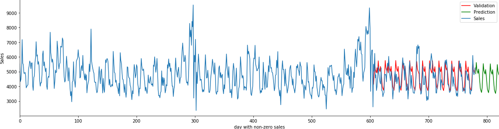

# Time series prediction with Azure ML Service

We solve a time series prediction
[problem](https://www.kaggle.com/c/rossmann-store-sales) by training
multiple models (
[statsmodels.tsa](https://www.statsmodels.org/stable/tsa.html) and
[xgboost](https://xgboost.readthedocs.io/en/latest/)) using the Azure ML
Service.

## Setup the Docker image 

- Build a docker image:

    ```bash
    docker build -f Dockerfile -t rossmann_img:0.1 .
    ```
- Test the image and the model:

    ```bash
    docker run -it --rm --name delete_me \
        -v "$(pwd)":/home/rossmann \
        -v "$(pwd)/../data":/home/data \
        -w /home/rossmann \
        rossmann_img:0.1 /bin/bash
    
    # Inside the image
    /opt/conda/envs/rossmann/bin/python train/train_01.py \
            --data_dir ../data/rossmann-store-sales/source \
            --max_pdq 4 1 2 \
            --n_stores 4
    ```    
    You can test the the other models in the same way: just look in
    `train/train_XY.py` under `if __name__ == '__main__':` to see an example
    how the model can be tested locally before submitting it to a remote
    compute instance.

- Push the image to a container registry (AML or Dockerhub): 

    Login to an AML container registry:
    ```bash
    docker login -u "$AML_CONTAINER_REGISTRY_USR" \
                 -p "$AML_CONTAINER_REGISTRY_PWD" \
                 $AML_CONTAINER_REGISTRY_SERVER
    ```
    or to Docker hub: 
    ```bash
    docker login -u "$DOCKER_HUB_USR" \
                 -p "$DOCKER_HUB_PWD"
    ```

- Tag the image and add it to the container registry:
    ```bash
    docker tag rossmann_img:0.1 $AML_CONTAINER_REGISTRY_SERVER/rossmann_img:0.1
    
    docker push $AML_CONTAINER_REGISTRY_SERVER/rossmann_img:0.1
    ```

## Training 
    
Look at [this](notebooks/AML_training_reforged.ipynb) notebook for more
information how to use Azure ML Service for model deployment.


## Models 

### Multiple SARIMAX models

We fit an individual SARIMAX model for every store. Some relevant steps:
- Remove items from the sequence where the store is closed and
  `sales=0`. An exogen variable `is_closed` can not completely
  compensate the effect of rapidly falling values of the time series to
  zero since it has an additive effect to the final outcome. 
  
- Transform `Date` to `days_since_start` and remove the trend option for
  the SARIMAX models (i.e. use `trend='c'` instead of `trend='ct'`)
  
- Do not use any periodicity options since a lot of data points are
  "missing" due to holidays.
    
- Hyperparameter selection. For every model pick the best (p,d,q) values
  from a predefined grid. For every combination we train a model in the
  interval \[2013-01-01 : 2014-12-31\] and use the prediction for the
  interval \[2015-01-01 : 2015-07-31\] to select the best (p,d,q). At
  the moment, we use the mean absolute error metric but code can be
  easily modified to use some information criteria or another metric.
  <br> 
  <br> 
  

  
### xgboost
Since this approach is extremely popular, I have added it. Variations of
the implementations of this model can be found
[here](https://www.kaggle.com/c/rossmann-store-sales/notebooks?sortBy=voteCount&group=everyone&pageSize=20&competitionId=4594).
